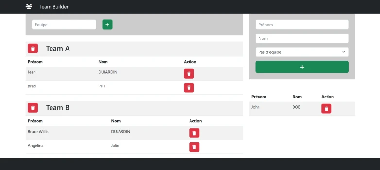

# TP Echo Team Builder
**live preview** :  
[Tester le TP Echo](https://www.sevenvalley.fr/tp-javascript/tpe) 



# TP Team Builder
Dans Real Time data Base
- créer un noeud personnes.json
- créer un noeud equipes.json

# Créer des components
<code>TrLigne.jsx</code> Appeler dans l' équipe et la liste des employés  
<code>TableEquipe.jsx</code> le composant Equipe    

# Créer les business object
- Personne.ts
- Equipe.ts

# Etapes
- ajouter une equipe
- ajouter une personne dans une equipe
- ajouter une personne dans l'entreprise
- supprimer une equipe
- enlever une personne d'une equipe
- enlever la personne de l'entreprise


## EXERCICES
**Excercice 1**  
Créer le tableau  **nouveauClients** à partir de personnes et clients  
utiliser <code>.filter</code> et <code>.find</code>
```js
    const personnes =[
        {id:1,nom:'BRAD',prenom:'PITT'},
        {id:2,nom:'TOM',prenom:'CRUISE'},
        {id:3,nom:'Angelina',prenom:'Jolie'},
        {id:4,nom:'Tom',prenom:'CRUISE'}
    ];
    const clients =[
        {id:1,nom:'BRAD',prenom:'PITT'},
        {id:3,nom:'Angelina',prenom:'Jolie',age:16}
    ];
// const nouveauClients =[
//         {id:2,nom:'TOM',prenom:'CRUISE'},
//         {id:4,nom:'Tom',prenom:'CRUISE'}
//     ];
```
**Excercice 2**  
Créer le tableau  **dejaClients** à partir de personnes et clients  
utiliser <code>.filter</code> et <code>.find</code>
```js
    const personnes =[
        {id:1,nom:'BRAD',prenom:'PITT'},
        {id:2,nom:'TOM',prenom:'CRUISE'},
        {id:3,nom:'Angelina',prenom:'Jolie'},
        {id:4,nom:'Tom',prenom:'CRUISE'}
    ];
    const clients =[
        {id:1,nom:'BRAD',prenom:'PITT'},
        {id:3,nom:'Angelina',prenom:'Jolie',age:16}
    ];
// const dejaClients =[
//     {id:1,nom:'BRAD',prenom:'PITT'},
//     {id:3,nom:'Angelina',prenom:'Jolie'},
//     ];
```

**Excercice 3**   
Créer le tableau  **majeurs** à partir de personnes  
utiliser <code>.fitler</code>
```js
        const personnes =[
        {id:1,nom:'BRAD',prenom:'PITT',age:18},
        {id:2,nom:'TOM',prenom:'CRUISE',age:15},
        {id:3,nom:'Angelina',prenom:'Jolie',age:16},
        {id:4,nom:'TOM',prenom:'CRUISE',age:61}
    ];
   
// const majeurs =[
//     {id:1,nom:'BRAD',prenom:'PITT',age:18},
//     {id:4,nom:'TOM',prenom:'CRUISE',age:61}
//     ];
```


**Excercice 4**  
Créer le tableau  **majeurs** à partir de personnes  
1 - Calucler le Total avec <code>.map</code>  
2 - calculer le Toatl avec <code>.reduce</code>
```js
const items = [
  { name: 'Apple', price: 1 },
  { name: 'Orange', price: 2 },
  { name: 'Mango', price: 3 },
];

let totalPrice = 0;

```