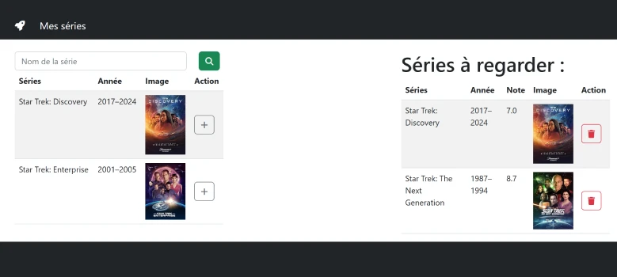

# TP 08 - Mes Séries préférées
 

- Récupérer un tableau de séries
avec **s=** pour récupérer un tableau
``` 
http://www.omdbapi.com/?apikey=xxxx&s=star
```
:one: Création du component <code>TrSearch</code>  
:two: Mise en place de  <code>Fetch</code> pour rechercher une série  
:three: Création du useState  <code>series</code>   
```jsx
  const [series,setSeries] = useState([]);
```
:four: Créer la fonction ajouter    
:five: Création du useState  <code>tabFav</code>    
```jsx
  const [tabFav,setTabFav] = useState([]);
```
:six: Fonction ajouter une série au tableau de fav <code>series</code> 
:seven: Créer une fonction asynchrone 
pour récupéré la note imdb (serie.imdbRating) avec l'id du film(serie.imdbID)
**i**=serie.imdbID
```
http://www.omdbapi.com/?apikey=xxxx&i=zzz
```
- Quand on ajoute la série elle s'enlève de la liste de recherche
- Enlever la série de la liste de favories
- Utiliser local storage
